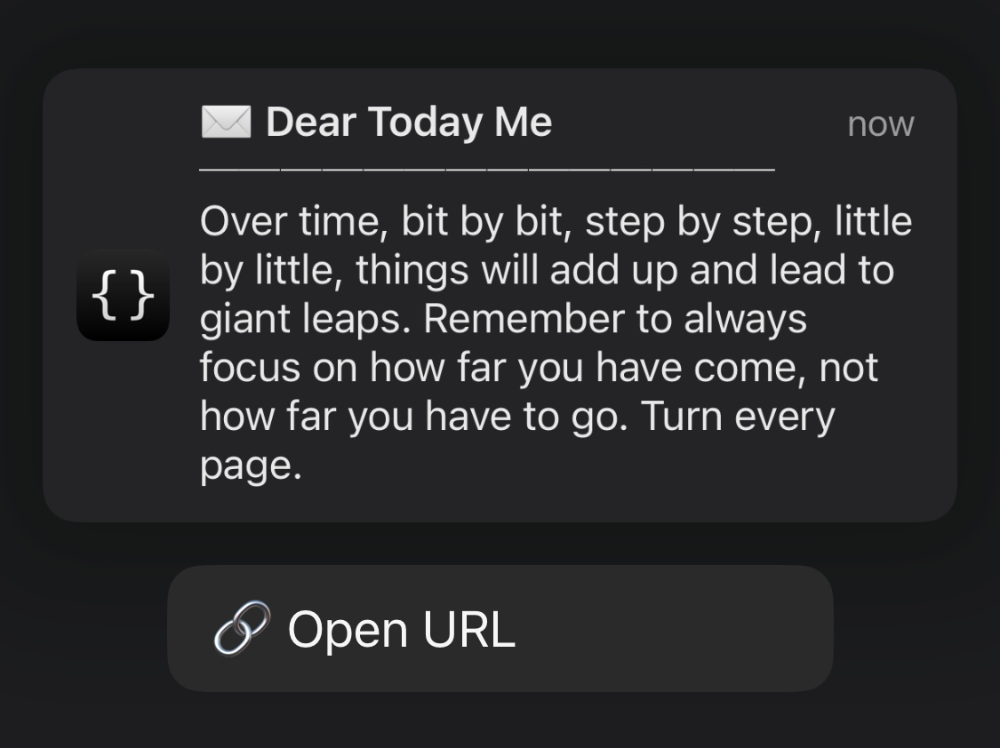
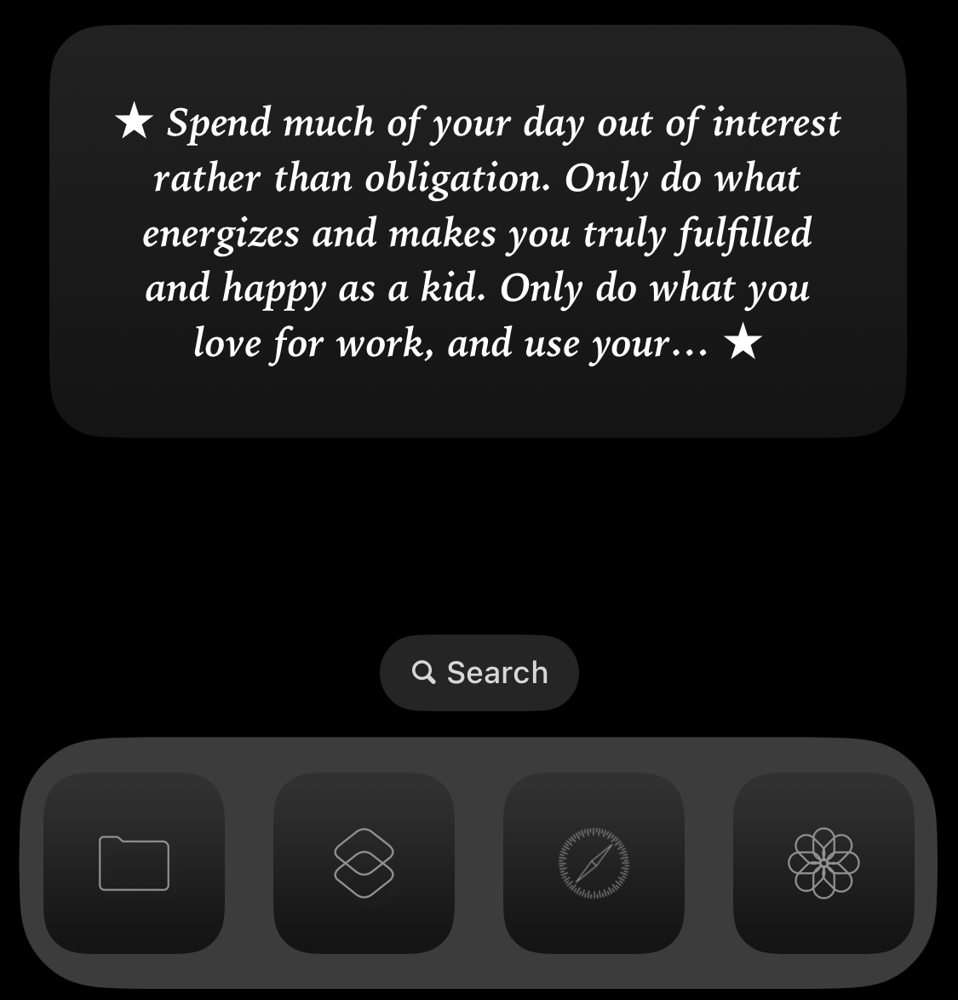
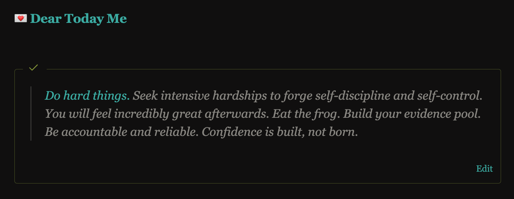

# Dear Today Me

> _“Nothing is good except what leads to fairness, self-control, courage, and free will. And nothing bad except what does the opposite.” — Marcus Aurelius_

## About

This repo maintains a letter to my present self from Better Me. The ideas in the letter represent my core values and the person I want to be. I strive to live by them every single day. Like the North Star, they guide me through the noise and chaos of life, so I can [center my thoughts and actions](https://en.wikipedia.org/wiki/1_in_60_rule) when I feel lost.

## Tools

To help you use the letter in your daily life. I built the following tools:

### For 👂

#### Apple Shortcut

Inspired by [Marcus Aurelius](https://www.goodreads.com/quotes/8177571-at-dawn-when-you-have-trouble-getting-out-of-bed), this shortcut reads the letter to you out loud, like a personal life coach in your pocket.

Setup

1. [Download the shortcut](https://shortcutomation.com/gallery/shared/your-pocket-life-coach/).
2. Tap **Add Shortcut**.
3. Run it by tapping it or asking Siri.

### For 👀

#### Scheduled Notification

Show a random excerpt from the letter on your Lock Screen.

<a href="assets/notification.png">
<kbd>

</kbd>
</a>

Setup

1. [Download the shortcut](https://shortcutomation.com/gallery/shared/dear-today-me/).
2. In the Shortcuts app, go to the **Automation** tab.
3. Tap `+` to make a new automation.
4. Pick a trigger, like **Time of Day**, and set a time.
5. Find and select the shortcut to run.

#### Scriptable Widget

Show a random excerpt from the letter on your Home Screen.

<a href="assets/widget.png">
<kbd>

</kbd>
</a>

Setup

1. [Copy the code](https://github.com/huaminghuangtw/Scriptable/blob/main/widget_dear-today-me.js) and paste it into a new script in the [Scriptable](https://scriptable.app) app.
2. On your Home Screen, add a [Scriptable widget](https://docs.scriptable.app/listwidget) in the size you like.
3. Tap the widget and choose the script you just created.

> [!TIP]
> _[Check out](https://github.com/huaminghuangtw/Scriptable) my other repository for customizable notifications and widgets created with [Scriptable](https://scriptable.app)!_

#### Obsidian Callout

If you use [Obsidian](https://obsidian.md), you can show a random excerpt from the letter in a [callout](https://help.obsidian.md/Editing+and+formatting/Callouts) with the [Dataview](https://github.com/blacksmithgu/obsidian-dataview) plugin.

<a href="assets/dashboard.png">
<kbd>

</kbd>
</a>

Setup

1. Install the [Dataview plugin](https://github.com/blacksmithgu/obsidian-dataview) in Obsidian.
2. [Copy the code](https://github.com/huaminghuangtw/Second-Brain/blob/main/Homepage.md#-dear-today-me) and paste it into a note.

## Support

You can view this project at [huami.ng/dear-today-me](https://huami.ng/dear-today-me). If you find this project valuable, please consider supporting my work by [buying me a coffee](https://buymeacoffee.com/huaming.huang).

## Contribution

Contributions are welcome! Please [open an issue](https://github.com/huaminghuangtw/Dear-Today-Me/issues/new) or [submit a pull request](https://github.com/huaminghuangtw/Dear-Today-Me/compare).
